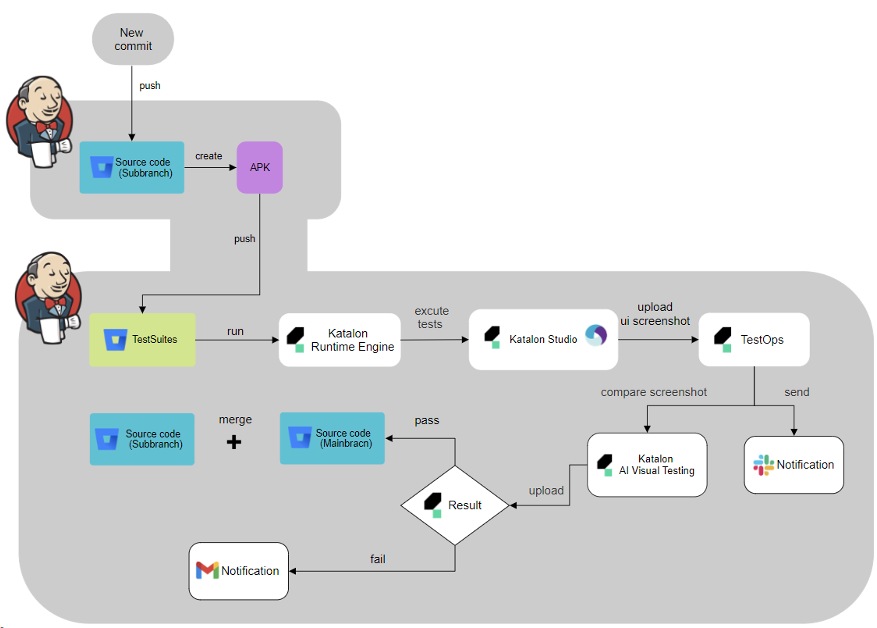
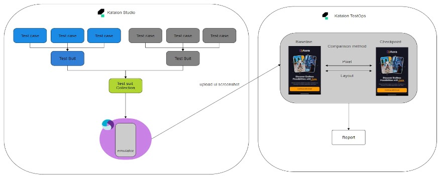

# Capstone-Jenkins-file
## AI-Driven Visual Testing for Mobile Applications

This project focuses on integrating AI-powered visual testing into the software development lifecycle for native mobile applications (iOS and Android). Our framework automates the detection of UI defects using advanced AI algorithms, reducing manual testing efforts and increasing accuracy. By seamlessly integrating with Continuous Integration/Continuous Deployment (CI/CD) pipelines through tools like Jenkins and Bitbucket, the system ensures dynamic, real-time testing and reporting.

Key features include:

- Automated UI testing using AI-based visual validation.
- Integration with Katalon Studio and TestOps for test management and reporting.
- Robust CI/CD pipeline for automated test execution upon code changes.
- Enhanced software quality and accelerated development cycles.
  
This solution addresses the challenges of traditional visual testing methods, offering scalability, reliability, and efficiency to streamline the development process.

## Pipeline Diagram

  

  1. First Pipeline: It will generate new apk file when the user has a new push for the application code. Then, it will push the new apk file to testing repository. The script of Jenkins file is [here](Jenkins).
  2. Second Pipeline: It will start testing with update apk file generated from first pipeline. It will automatically execute test suites in Katalon Studio and upload the UI screenshot to Katalon TestOps. It will send notification of the test result via Gmail and Slack. If the test result is success, it will automatically merge sub-branch and main-branch of application code. the script of Jenkins file is [here](JenkinsForTesting).

## Visual Testing Diagram

  

